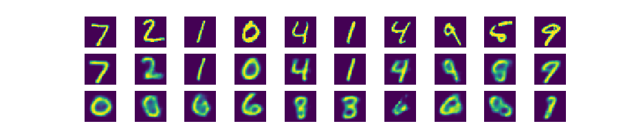

Autoencoder can be considered a data compression or feature extraction tool, since it can effectively compress the input to lower dimension without losing much information. However it's not generative, in the sense that if you feed the decoder with a Gaussian random vector, you won't get a output image resembling a sample in the dataset. This is because the distribution of the encoded vector is not controlled by the training process, so it's not necessarily Gaussian. If we want a specific distribution, we need to add a loss function that measures the shape of the distribution. In VAE, a KL loss is added on top of a reconstruction loss.

